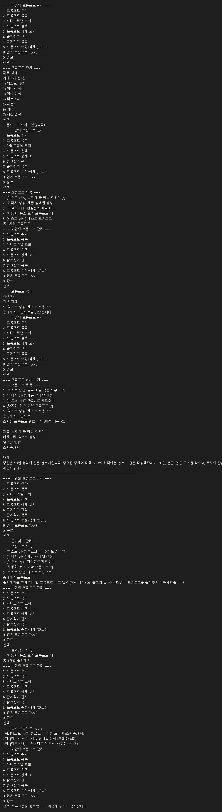
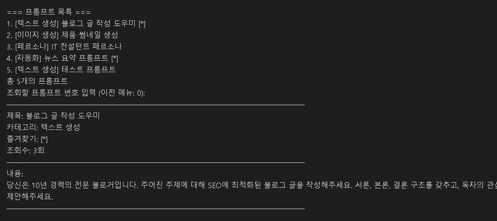
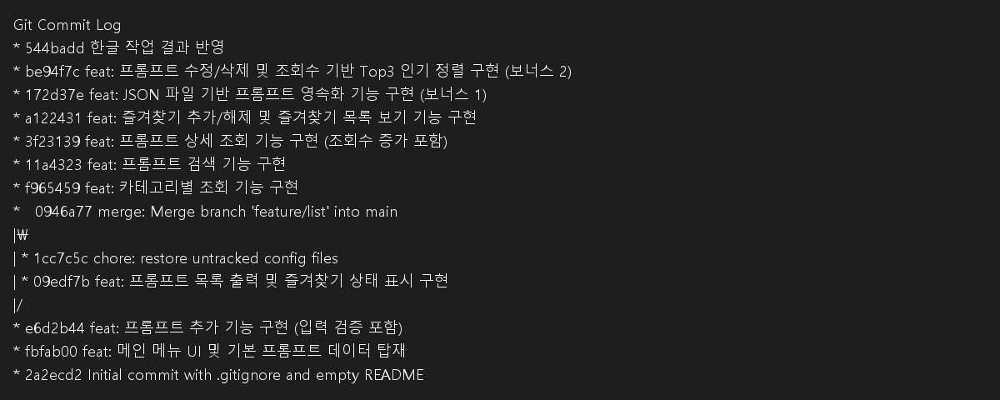

# 📝 [최종 제출 보고서] 나만의 프롬프트 관리 시스템 (My Prompt Manager)

본 프로젝트는 생성형 AI 프롬프트를 체계적으로 관리할 수 있는 **파이썬(Python) 콘솔 프로그램**과 **Git/GitHub 버전 관리 이력**을 포함하는 과제 최종 제출물입니다.

---

## 💻 1. 개발 환경 (Development Environment)

* **언어**: Python `3.10` 이상 (기본 제공 문법 및 내장 라이브러리 `json`, `os`만 사용)
* **버전 관리**: Git
* **편집기**: VSCode
* **인코딩**: UTF-8

### 개발 환경 확인 및 실행 준비 완료


---

## 🛠️ 2. 프로그램 주요 기능 목록

### 📌 필수 요구사항 구현
| 메뉴 번호 | 기능명 | 상세 내용 |
| :---: | :--- | :--- |
| **1** | **프롬프트 추가** | 제목, 내용, 카테고리를 입력받아 신규 저장합니다. 공백 입력 시 유효성 검사를 진행합니다. |
| **2** | **프롬프트 목록** | 저장된 프롬프트 전체 목록을 출력하며, 즐겨찾기 상태(⭐)를 직관적으로 표현합니다. |
| **3** | **카테고리별 조회** | 텍스트 생성, 이미지 생성, 영상 생성 등 특정 카테고리를 필터링하여 출력합니다. |
| **4** | **프롬프트 검색** | 대소문자 구분 없이 제목이나 내용에 검색어가 포함된 프롬프트를 탐색합니다. |
| **5** | **프롬프트 상세 보기** | 특정 번호의 프롬프트 상세 데이터(제목, 내용 전체, 카테고리, 즐겨찾기, 조회수)를 확인합니다. |
| **6** | **즐겨찾기 관리** | 지정한 프롬프트의 즐겨찾기 상태를 등록/해제(토글)합니다. |
| **7** | **즐겨찾기 목록** | 즐겨찾기(⭐)로 체크된 프롬프트만 모아서 가볍게 조회합니다. |
| **0** | **종료** | 프로그램을 루프에서 탈출시켜 안전하게 종료합니다. |

### 🚀 보너스 요구사항 구현 (심화 기능)
* **8. 프롬프트 수정/삭제 (CRUD)**
  * 기존 등록된 프롬프트의 제목, 내용, 카테고리를 개별 수정할 수 있습니다. (입력 없이 Enter 시 기존 값 유지)
  * 프롬프트를 목록에서 완전히 제거(Delete)할 수 있으며, 삭제 전 오작동을 방지하는 확인 절차(`y/n`)를 거칩니다.
* **9. 인기 프롬프트 Top 3**
  * 사용자가 상세 보기(5번 메뉴)를 실행할 때마다 누적되는 **조회수(Views)**를 기준으로 내림차순 정렬하여 가장 자주 본 프롬프트 3개를 출력합니다.
* **JSON 파일 기반 데이터 영속화**
  * `02_source/prompts.json` 파일에 데이터를 저장합니다.
  * 프로그램 실행 시 자동으로 로컬 JSON 파일을 불러오며(Load), 데이터가 추가/수정/삭제/즐겨찾기 변경될 때마다 자동으로 저장(Save)되어 프로그램 종료 후 재실행 시에도 데이터가 완벽하게 유지됩니다.

---

## ⚡ 3. 실행 방법

1. 터미널(Terminal)을 실행하고 프로젝트 루트 디렉토리로 이동합니다.
2. 아래 명령어를 실행하여 프로그램을 구동합니다.
   ```bash
   python 02_source/main.py
   ```

### 프로그램 초기 실행 화면 (메뉴)


---

## 📖 4. 프로그램 사용 설명

### 4-1. 실행 명령과 준비
* 프로젝트 루트 폴더에서 터미널을 열고 `python 02_source/main.py`를 입력합니다.
* `02_source/main.py`가 실행되면 프로그램이 `02_source/prompts.json` 파일을 자동으로 불러옵니다.
* 만약 `prompts.json`이 없으면 기본 예제 프롬프트 4개를 자동으로 생성하고 저장합니다.

### 4-2. 메뉴 선택 방식
* 프로그램은 숫자 메뉴로 작동합니다.
* 각 기능을 선택하려면 `선택:` 프롬프트에 번호를 입력하고 Enter를 누릅니다.
* 잘못된 숫자를 입력하면 안내 메시지가 출력되고 다시 선택할 수 있습니다.

### 4-3. 기능별 설명
* `1. 프롬프트 추가`
  * 제목, 내용, 카테고리를 차례로 입력합니다.
  * 입력값이 비어있으면 다시 입력을 요청합니다.
  * 선택한 카테고리는 미리 정의된 목록에서 고르거나 직접 입력할 수 있습니다.
  * 입력 완료 후 `save_data()`가 실행되어 JSON 파일에 저장됩니다.
  * 

* `2. 프롬프트 목록`
  * 현재 저장된 모든 프롬프트를 번호와 함께 출력합니다.
  * 즐겨찾기가 활성화된 항목은 `[*]` 표시로 나타납니다.
  * 프롬프트가 없으면 안내 메시지를 보여줍니다.
  * 

* `3. 카테고리별 조회`
  * 미리 정의된 카테고리 목록을 출력합니다.
  * 원하는 카테고리 번호를 입력하면 해당 카테고리의 프롬프트만 필터링하여 보여줍니다.

* `4. 프롬프트 검색`
  * 제목 또는 내용에 포함된 키워드로 검색합니다.
  * 입력한 검색어가 포함된 프롬프트를 모두 찾아서 출력합니다.
  * 

* `5. 프롬프트 상세 보기`
  * 전체 목록에서 조회할 프롬프트 번호를 입력합니다.
  * 선택한 프롬프트의 제목, 카테고리, 즐겨찾기 여부, 조회수, 전체 내용을 보여줍니다.
  * 이 기능은 조회할 때마다 `views` 값을 1씩 증가시켜 인기 순위에 반영합니다.
  * 

* `6. 즐겨찾기 관리`
  * 프롬프트 번호를 입력하면 해당 항목의 즐겨찾기 상태를 토글합니다.
  * 즐겨찾기를 추가하면 `[*]`로 표시되고, 다시 선택하면 해제됩니다.

* `7. 즐겨찾기 목록`
  * 현재 즐겨찾기된 항목만 모아서 보여줍니다.
  * 즐겨찾기된 프롬프트가 없으면 안내 메시지를 출력합니다.
  * 

* `8. 프롬프트 수정/삭제 (CRUD)`
  * 수정하거나 삭제할 프롬프트 번호를 입력합니다.
  * 수정 선택 시 제목, 내용, 카테고리를 개별 변경할 수 있습니다.
  * 삭제 선택 시 `y/n` 확인을 거쳐 안전하게 삭제합니다.

* `9. 인기 프롬프트 Top 3`
  * 상세 보기에서 증가한 조회수를 기준으로 상위 3개 프롬프트를 보여줍니다.
  * 이 기능은 조회수가 반영된 인기 순위를 확인할 때 사용합니다.
  * 

* `0. 종료`
  * 프로그램을 안전하게 종료합니다.

### 4-4. 데이터 저장 흐름
* 프로그램이 시작될 때 `load_data()`가 실행됩니다.
  * `02_source/prompts.json`이 있으면 파일 내용을 불러옵니다.
  * 파일이 없거나 오류가 생기면 기본 프롬프트 데이터로 초기화합니다.
* 프롬프트 추가, 수정, 삭제, 즐겨찾기 토글 또는 상세 보기 후에는 `save_data()`가 실행됩니다.
  * 이 함수는 리스트 데이터를 JSON으로 변환해 `02_source/prompts.json`에 저장합니다.

### 4-5. 초보자를 위한 용어 해설 및 발표 팁 💡

이 프로젝트를 처음 접하거나 제출 후 비전공자에게 설명해야 할 때, 아래 핵심 개념들을 참고하여 답변을 준비하면 큰 도움이 됩니다.

#### 🔑 주요 핵심 용어 사전
* **CRUD (크러드)**
  * 데이터를 다룰 때 쓰이는 가장 기본적이고 필수적인 4가지 동작을 뜻합니다.
  * **C**reate(추가), **R**ead(목록/상세보기 조회), **U**pdate(수정), **D**elete(삭제)의 약자입니다.
* **데이터 영속화 (Data Persistence)**
  * 프로그램이 꺼져도 입력한 데이터가 사라지지 않고 유지되는 것을 의미합니다.
  * 이 프로그램은 프롬프트를 추가하거나 수정할 때마다 메모리에만 올려두는 것이 아니라, 컴퓨터 하드디스크의 `02_source/prompts.json` 파일에 즉시 저장하여 **영속성**을 갖도록 구현했습니다.
* **JSON (제이슨)**
  * 복잡한 데이터를 컴퓨터가 쉽게 읽고 쓸 수 있는 텍스트 포맷입니다. `{ "키": "값" }` 형태로 이루어져 있으며, 파이썬의 **딕셔너리(Dictionary)** 구조와 완벽히 호환되어 데이터 저장용 로컬 DB로 채택했습니다.
* **예외 처리 및 유효성 검사 (Validation & Exception Handling)**
  * 사용자가 오작동할 만한 상황(빈 칸 입력, 메뉴에 없는 문자 입력, 없는 번호 조회 등)에 프로그램이 에러를 뿜으며 강제 종료되지 않고, 친절한 경고 메시지를 띄우며 정상 흐름을 이어가도록 돕는 안전장치 코드입니다.
* **브랜치 병합 (Branch Merge)**
  * 안전한 개발을 위해 메인 코드(`main` 브랜치)에 직접 코딩하지 않고, 별도의 작업 공간(`feature/list` 브랜치)을 복사해 만든 뒤 테스트를 거쳐 안전하게 합치는(Merge) Git 협업 프로세스입니다.

#### 🎤 발표 및 설명 가이드 팁
* **"왜 외부 DB 대신 JSON을 썼나요?"** 라고 묻는다면:
  * *"가볍고 복잡한 설정 없이 로컬에서 바로 실행할 수 있으며, 이 프로그램에서 관리하는 텍스트 기반 프롬프트 데이터를 영속화하는 데 가장 직관적이고 효율적인 포맷이기 때문에 JSON 파일을 가상 데이터베이스로 설계했습니다."*
* **"코드 구조화에서 가장 신경 쓴 부분은 무엇인가요?"** 라고 묻는다면:
  * *"가독성과 재사용성을 높이기 위해 모든 기능을 한 곳에 몰아넣지 않고, 메뉴 출력(`show_menu()`), 추가(`add_prompt()`), 목록 조회(`show_list()`) 등 **기능별로 함수(Function)를 쪼개어 독립적으로 동작**하도록 설계한 부분입니다."*
* **"안전하게 종료해야 하는 이유가 있나요?"** 라고 묻는다면:
  * *"프로그램은 실행 도중 발생한 변경사항을 지속해서 JSON 파일에 안전하게 동기화합니다. `Ctrl+C`로 강제 종료하기보다는 프로그램 내부의 `0`번 메뉴를 선택해 루프를 안전하게 빠져나가도록 설계되었습니다."*

---

## 🌿 5. Git 버전 관리 및 브랜치 병합 이력

과제 요구조건(최소 10개 이상의 커밋, 브랜치 병합 이력 필수)을 만족하기 위해 기능 단위로 커밋을 세분화하여 작업하였으며, **목록 출력 기능**은 `feature/list` 브랜치를 생성하여 개발한 후 `main` 브랜치에 병합(`merge --no-ff`)하는 프로세스를 밟았습니다.

### 📊 Git 커밋 로그 그래프 (`git log --oneline --graph --all`)

```text
* be94f7c feat: 프롬프트 수정/삭제 및 조회수 기반 Top3 인기 정렬 구현 (보너스 2)
* 172d37e feat: JSON 파일 기반 프롬프트 영속화 기능 구현 (보너스 1)
* a122431 feat: 즐겨찾기 추가/해제 및 즐겨찾기 목록 보기 기능 구현
* 3f23139 feat: 프롬프트 상세 조회 기능 구현 (조회수 증가 포함)
* 11a4323 feat: 프롬프트 검색 기능 구현
* f965459 feat: 카테고리별 조회 기능 구현
*   0946a77 merge: Merge branch 'feature/list' into main
|\  
| * 1cc7c5c chore: restore untracked config files
| * 09edf7b feat: 프롬프트 목록 출력 및 즐겨찾기 상태 표시 구현
|/  
* e6d2b44 feat: 프롬프트 추가 기능 구현 (입력 검증 포함)
* fbfab00 feat: 메인 메뉴 UI 및 기본 프롬프트 데이터 탑재
* 2a2ecd2 Initial commit with .gitignore and empty README
```

### 📸 Git 버전 관리 실행 화면

