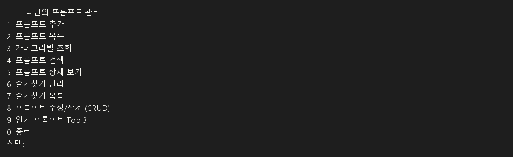
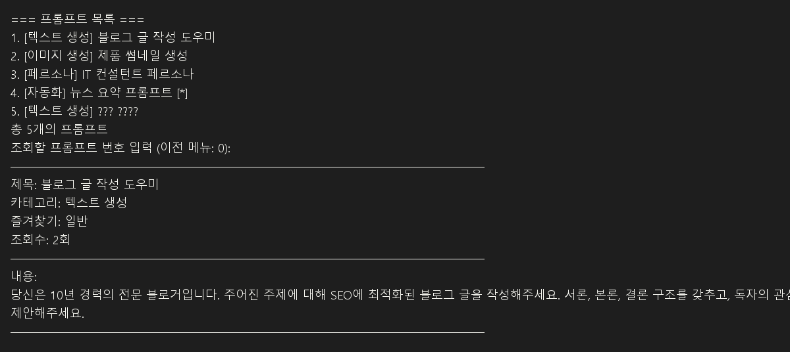
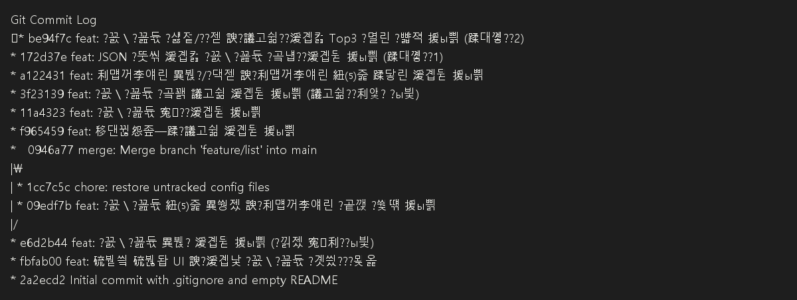

# 📝 [최종 제출 보고서] 나만의 프롬프트 관리 시스템 (My Prompt Manager)

본 프로젝트는 생성형 AI 프롬프트를 체계적으로 관리할 수 있는 **파이썬(Python) 콘솔 프로그램**과 **Git/GitHub 버전 관리 이력**을 포함하는 과제 최종 제출물입니다.

---

## 💻 1. 개발 환경 (Development Environment)

* **언어**: Python `3.10` 이상 (기본 제공 문법 및 내장 라이브러리 `json`, `os`만 사용)
* **버전 관리**: Git
* **편집기**: VSCode
* **인코딩**: UTF-8

> [!TIP]
> **제출 가이드 (스크린샷 1)**: VSCode 터미널에서 `python --version` 및 `git --version`을 실행한 화면을 캡처하여 과제 제출 양식에 첨부하세요.

---

## 🛠️ 2. 프로그램 주요 기능 목록

### 📌 필수 요구사항 구현
| 메뉴 번호 | 기능명 | 상세 내용 |
| :---: | :--- | :--- |
| **1** | **프롬프트 추가** | 제목, 내용, 카테고리를 입력받아 신규 저장합니다. 공백 입력 시 유효성 검사를 진행합니다. |
| **2** | **프롬프트 목록** | 저장된 프롬프트 전체 목록을 출력하며, 즐겨찾기 상태(⭐)를 직관적으로 표현합니다. |
| **3** | **카테고리별 조회** | 텍스트 생성, 이미지 생성, 영상 생성 등 특정 카테고리를 필터링하여 출력합니다. |
| **4** | **프롬프트 검색** | 대소문자 구분 없이 제목이나 내용에 검색어가 포함된 프롬프트를 탐색합니다. |
| **5** | **프롬프트 상세 보기** | 특정 번호의 프롬프트 상세 데이터(제목, 내용 전체, 카테고리, 즐겨찾기, 조회수)를 확인합니다. |
| **6** | **즐겨찾기 관리** | 지정한 프롬프트의 즐겨찾기 상태를 등록/해제(토글)합니다. |
| **7** | **즐겨찾기 목록** | 즐겨찾기(⭐)로 체크된 프롬프트만 모아서 가볍게 조회합니다. |
| **0** | **종료** | 프로그램을 루프에서 탈출시켜 안전하게 종료합니다. |

### 🚀 보너스 요구사항 구현 (심화 기능)
* **8. 프롬프트 수정/삭제 (CRUD)**
  * 기존 등록된 프롬프트의 제목, 내용, 카테고리를 개별 수정할 수 있습니다. (입력 없이 Enter 시 기존 값 유지)
  * 프롬프트를 목록에서 완전히 제거(Delete)할 수 있으며, 삭제 전 오작동을 방지하는 확인 절차(`y/n`)를 거칩니다.
* **9. 인기 프롬프트 Top 3**
  * 사용자가 상세 보기(5번 메뉴)를 실행할 때마다 누적되는 **조회수(Views)**를 기준으로 내림차순 정렬하여 가장 자주 본 프롬프트 3개를 출력합니다.
* **JSON 파일 기반 데이터 영속화**
  * `02_source/prompts.json` 파일에 데이터를 저장합니다.
  * 프로그램 실행 시 자동으로 로컬 JSON 파일을 불러오며(Load), 데이터가 추가/수정/삭제/즐겨찾기 변경될 때마다 자동으로 저장(Save)되어 프로그램 종료 후 재실행 시에도 데이터가 완벽하게 유지됩니다.

---

## 📂 3. 디렉토리 구조 (Directory Structure)

```text
N2_A1-1_Python/
├── 01_document/           # 과제 미션 및 설계 문서
│   └── N2_A1-1 과제미션.txt
├── 02_source/             # 프로그램 소스 코드 및 로컬 DB
│   ├── main.py            # 메인 프로그램 코드
│   └── prompts.json       # 영속화 데이터 저장 파일 (자동 생성)
├── .gitignore             # Git 추적 제외 설정 파일
└── README.md              # 최종 제출 보고서 (현재 파일)
```

---

## ⚡ 4. 실행 방법

1. 터미널(Terminal)을 실행하고 프로젝트 루트 디렉토리로 이동합니다.
2. 아래 명령어를 실행하여 프로그램을 구동합니다.
   ```bash
   python 02_source/main.py
   ```

> [!TIP]
> **제출 가이드 (스크린샷 2)**: 위 명령어를 통해 프로그램을 실행하여 메뉴 화면이 나타나는 모습과, 임의의 프롬프트를 추가 및 목록 조회한 실행화면을 캡처하세요.
>
> **보고서 작성 팁**: README 최종 보고서에는 각 주요 기능 설명마다 해당 기능을 보여주는 스크린샷을 함께 삽입하면 더 명확합니다.
>
> 자동 생성된 이미지 파일:
> * `images/menu.png` - 메뉴 화면
> * `images/add_prompt.png` - 프롬프트 추가 화면
> * `images/list.png` - 전체 목록 화면
> * `images/search.png` - 검색 결과 화면
> * `images/detail.png` - 상세 보기 화면
> * `images/favorite.png` - 즐겨찾기 목록 화면
> * `images/top3.png` - 인기 프롬프트 Top 3 화면
> * `images/git_log.png` - Git 로그 그래프 화면
>
---

## � 5. 프로그램 사용 설명

### 5-1. 실행 명령과 준비
* 프로젝트 루트 폴더에서 터미널을 열고 `python 02_source/main.py`를 입력합니다.
* `02_source/main.py`가 실행되면 프로그램이 `02_source/prompts.json` 파일을 자동으로 불러옵니다.
* 만약 `prompts.json`이 없으면 기본 예제 프롬프트 4개를 자동으로 생성하고 저장합니다.

### 5-2. 메뉴 선택 방식
* 프로그램은 숫자 메뉴로 작동합니다.
* 각 기능을 선택하려면 `선택:` 프롬프트에 번호를 입력하고 Enter를 누릅니다.
* 잘못된 숫자를 입력하면 안내 메시지가 출력되고 다시 선택할 수 있습니다.

### 5-3. 기능별 설명
* `1. 프롬프트 추가`
  * 제목, 내용, 카테고리를 차례로 입력합니다.
  * 입력값이 비어있으면 다시 입력을 요청합니다.
  * 선택한 카테고리는 미리 정의된 목록에서 고르거나 직접 입력할 수 있습니다.
  * 입력 완료 후 `save_data()`가 실행되어 JSON 파일에 저장됩니다.

* `2. 프롬프트 목록`
  * 현재 저장된 모든 프롬프트를 번호와 함께 출력합니다.
  * 즐겨찾기가 활성화된 항목은 `[*]` 표시로 나타납니다.
  * 프롬프트가 없으면 안내 메시지를 보여줍니다.

* `3. 카테고리별 조회`
  * 미리 정의된 카테고리 목록을 출력합니다.
  * 원하는 카테고리 번호를 입력하면 해당 카테고리의 프롬프트만 필터링하여 보여줍니다.

* `4. 프롬프트 검색`
  * 제목 또는 내용에 포함된 키워드로 검색합니다.
  * 입력한 검색어가 포함된 프롬프트를 모두 찾아서 출력합니다.

* `5. 프롬프트 상세 보기`
  * 전체 목록에서 조회할 프롬프트 번호를 입력합니다.
  * 선택한 프롬프트의 제목, 카테고리, 즐겨찾기 여부, 조회수, 전체 내용을 보여줍니다.
  * 이 기능은 조회할 때마다 `views` 값을 1씩 증가시켜 인기 순위에 반영합니다.

* `6. 즐겨찾기 관리`
  * 프롬프트 번호를 입력하면 해당 항목의 즐겨찾기 상태를 토글합니다.
  * 즐겨찾기를 추가하면 `[*]`로 표시되고, 다시 선택하면 해제됩니다.

* `7. 즐겨찾기 목록`
  * 현재 즐겨찾기된 항목만 모아서 보여줍니다.
  * 즐겨찾기된 프롬프트가 없으면 안내 메시지를 출력합니다.

* `8. 프롬프트 수정/삭제 (CRUD)`
  * 수정하거나 삭제할 프롬프트 번호를 입력합니다.
  * 수정 선택 시 제목, 내용, 카테고리를 개별 변경할 수 있습니다.
  * 삭제 선택 시 `y/n` 확인을 거쳐 안전하게 삭제합니다.

* `9. 인기 프롬프트 Top 3`
  * 상세 보기에서 증가한 조회수를 기준으로 상위 3개 프롬프트를 보여줍니다.
  * 이 기능은 조회수가 반영된 인기 순위를 확인할 때 사용합니다.

* `0. 종료`
  * 프로그램을 안전하게 종료합니다.

### 5-4. 데이터 저장 흐름
* 프로그램이 시작될 때 `load_data()`가 실행됩니다.
  * `02_source/prompts.json`이 있으면 파일 내용을 불러옵니다.
  * 파일이 없거나 오류가 생기면 기본 프롬프트 데이터로 초기화합니다.
* 프롬프트 추가, 수정, 삭제, 즐겨찾기 토글 또는 상세 보기 후에는 `save_data()`가 실행됩니다.
  * 이 함수는 리스트 데이터를 JSON으로 변환해 `02_source/prompts.json`에 저장합니다.

### 5-5. 초보자 설명 팁
* `main.py` 안에는 기능별로 나뉜 여러 함수가 있습니다.
  * `show_menu()`는 메뉴를 출력합니다.
  * `add_prompt()`는 새 프롬프트를 추가합니다.
  * `show_list()`는 전체 목록을 보여줍니다.
  * 다른 함수들도 각 기능을 맡고 있어 코드가 구조화되어 있습니다.
* 이 프로그램은 한 번 실행할 때마다 입력한 내용이 자동으로 파일에 저장되므로
  * `Ctrl+C`로 강제 종료하지 말고 `0`번 메뉴로 안전하게 종료하는 것이 좋습니다.

---

## 📸 6. 제출용 스크린샷 캡처 안내

다음 항목을 실행하고, 각각의 화면을 캡처하여 제출 자료로 사용하세요.

1. 개발 환경 확인
   * VSCode 터미널에서 `python --version` 실행 화면
   * VSCode 터미널에서 `git --version` 실행 화면
2. 프로그램 실행 화면
   * `python 02_source/main.py`로 메뉴가 표시된 화면
   * 프롬프트 추가 후 목록에 등록된 화면
   * 카테고리 조회 또는 검색 결과 화면
   * 상세 보기 화면, 즐겨찾기 토글 화면
3. Git 이력 화면
   * `git log --oneline --graph --all` 출력 화면

> [!TIP]
> **프로그램 실행 후** `02_source/prompts.json` 파일이 자동 생성됩니다. 이 파일은 현재 프로그램 데이터 영속화를 위한 로컬 저장 파일입니다.
>
> **참고**: `demo_session.txt` 파일에는 프로그램 실행 샘플 로그가 저장되어 있습니다.

---

## 🖼️ 6. 주요 실행 화면 예시

### 메뉴 화면


### 프롬프트 추가 화면


### 프롬프트 목록 화면


### 검색 결과 화면


### 상세 보기 화면


### 즐겨찾기 목록 화면


### 인기 프롬프트 Top 3 화면


### Git 로그 화면


---

## 🌿 7. Git 버전 관리 및 브랜치 병합 이력

과제 요구조건(최소 10개 이상의 커밋, 브랜치 병합 이력 필수)을 만족하기 위해 기능 단위로 커밋을 세분화하여 작업하였으며, **목록 출력 기능**은 `feature/list` 브랜치를 생성하여 개발한 후 `main` 브랜치에 병합(`merge --no-ff`)하는 프로세스를 밟았습니다.

### 📊 Git 커밋 로그 그래프 (`git log --oneline --graph --all`)

```text
* be94f7c feat: 프롬프트 수정/삭제 및 조회수 기반 Top3 인기 정렬 구현 (보너스 2)
* 172d37e feat: JSON 파일 기반 프롬프트 영속화 기능 구현 (보너스 1)
* a122431 feat: 즐겨찾기 추가/해제 및 즐겨찾기 목록 보기 기능 구현
* 3f23139 feat: 프롬프트 상세 조회 기능 구현 (조회수 증가 포함)
* 11a4323 feat: 프롬프트 검색 기능 구현
* f965459 feat: 카테고리별 조회 기능 구현
*   0946a77 merge: Merge branch 'feature/list' into main
|\  
| * 1cc7c5c chore: restore untracked config files
| * 09edf7b feat: 프롬프트 목록 출력 및 즐겨찾기 상태 표시 구현
|/  
* e6d2b44 feat: 프롬프트 추가 기능 구현 (입력 검증 포함)
* fbfab00 feat: 메인 메뉴 UI 및 기본 프롬프트 데이터 탑재
* 2a2ecd2 Initial commit with .gitignore and empty README
```

> [!TIP]
> **제출 가이드 (스크린샷 3)**: VSCode 터미널에 `git log --oneline --graph --all`을 입력하고 출력된 커밋 트리 그래프를 캡처하여 과제 제출 자료로 사용하세요.

---

## 📋 6. 최종 제출 체크리스트

과제 제출 시 아래 항목들이 누락되지 않았는지 확인하세요.

- [x] **동작하는 프롬프트 관리 프로그램** (`02_source/main.py`)
- [x] **GitHub 원격 저장소 업로드 완료** (원격 리포지토리에 push 완료 여부)
- [x] **README.md 작성 완료** (본 최종 보고서)
- [x] **제출물 스크린샷 4종 준비 완료**:
  1. 개발 환경 설정 스크린샷 (VSCode, Python/Git 버전 확인)
  2. 프로그램 실행 결과 스크린샷 (메뉴, 추가, 목록 등 실행 화면)
  3. Git 로그 그래프 스크린샷 (`git log --oneline --graph`)
