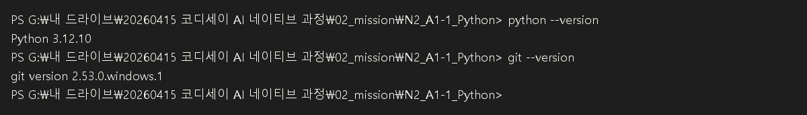
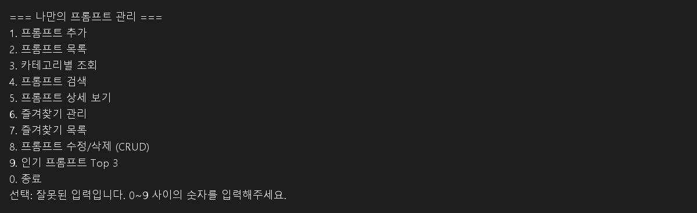

# 📝 [최종 제출 보고서] 나만의 프롬프트 관리 시스템 (My Prompt Manager)

본 프로젝트는 생성형 AI 프롬프트를 체계적으로 관리할 수 있는 **파이썬(Python) 콘솔 프로그램**과 **Git/GitHub 버전 관리 이력**을 포함하는 과제 최종 제출물입니다.

---

## 💻 1. 개발 환경 (Development Environment)

* **언어**: Python `3.10` 이상 (기본 제공 문법 및 내장 라이브러리 `json`, `os`만 사용)
* **버전 관리**: Git
* **편집기**: VSCode
* **인코딩**: UTF-8

### 개발 환경 확인 및 실행 준비 완료


---

## 🛠️ 2. 프로그램 주요 기능 목록

### 📌 필수 요구사항 구현
| 메뉴 번호 | 기능명 | 상세 내용 |
| :---: | :--- | :--- |
| **1** | **프롬프트 추가** | 제목, 내용, 카테고리를 입력받아 신규 저장합니다. 공백 입력 시 유효성 검사를 진행합니다. |
| **2** | **프롬프트 목록** | 저장된 프롬프트 전체 목록을 출력하며, 즐겨찾기 상태(⭐)를 직관적으로 표현합니다. |
| **3** | **카테고리별 조회** | 텍스트 생성, 이미지 생성, 영상 생성 등 특정 카테고리를 필터링하여 출력합니다. |
| **4** | **프롬프트 검색** | 대소문자 구분 없이 제목이나 내용에 검색어가 포함된 프롬프트를 탐색합니다. |
| **5** | **프롬프트 상세 보기** | 특정 번호의 프롬프트 상세 데이터(제목, 내용 전체, 카테고리, 즐겨찾기, 조회수)를 확인합니다. |
| **6** | **즐겨찾기 관리** | 지정한 프롬프트의 즐겨찾기 상태를 등록/해제(토글)합니다. |
| **7** | **즐겨찾기 목록** | 즐겨찾기(⭐)로 체크된 프롬프트만 모아서 가볍게 조회합니다. |
| **0** | **종료** | 프로그램을 루프에서 탈출시켜 안전하게 종료합니다. |

### 🚀 보너스 요구사항 구현 (심화 기능)
* **8. 프롬프트 수정/삭제 (CRUD)**
  * 기존 등록된 프롬프트의 제목, 내용, 카테고리를 개별 수정할 수 있습니다. (입력 없이 Enter 시 기존 값 유지)
  * 프롬프트를 목록에서 완전히 제거(Delete)할 수 있으며, 삭제 전 오작동을 방지하는 확인 절차(`y/n`)를 거칩니다.
* **9. 인기 프롬프트 Top 3**
  * 사용자가 상세 보기(5번 메뉴)를 실행할 때마다 누적되는 **조회수(Views)**를 기준으로 내림차순 정렬하여 가장 자주 본 프롬프트 3개를 출력합니다.
* **JSON 파일 기반 데이터 영속화**
  * 루트 폴더의 `prompts.json` 파일에 데이터를 저장합니다.
  * 프로그램 실행 시 자동으로 로컬 JSON 파일을 불러오며(Load), 데이터가 추가/수정/삭제/즐겨찾기 변경될 때마다 자동으로 저장(Save)되어 프로그램 종료 후 재실행 시에도 데이터가 완벽하게 유지됩니다.

---

## ⚡ 3. 실행 방법

1. 터미널(Terminal)을 실행하고 프로젝트 루트 디렉토리로 이동합니다.
2. 아래 명령어를 실행하여 프로그램을 구동합니다.
   ```bash
   python main.py
   ```

### 프로그램 초기 실행 화면 (메뉴)


---

## 📖 4. 프로그램 사용 설명

### 4-1. 실행 명령과 준비
* 프로젝트 루트 폴더에서 터미널을 열고 `python main.py`를 입력합니다.
* `main.py`가 실행되면 프로그램이 루트 폴더의 `prompts.json` 파일을 자동으로 불러옵니다.
* 만약 `prompts.json`이 없으면 기본 예제 프롬프트 4개를 자동으로 생성하고 저장합니다.

### 4-2. 메뉴 선택 방식
* 프로그램은 숫자 메뉴로 작동합니다.
* 각 기능을 선택하려면 `선택:` 프롬프트에 번호를 입력하고 Enter를 누릅니다.
* 잘못된 숫자를 입력하면 안내 메시지가 출력되고 다시 선택할 수 있습니다.
  * 

### 4-3. 기능별 설명
* `1. 프롬프트 추가`
  * 제목, 내용, 카테고리를 차례로 입력합니다.
  * 입력값이 비어있으면 다시 입력을 요청합니다.
  * 선택한 카테고리는 미리 정의된 목록에서 고르거나 직접 입력할 수 있습니다.
  * 입력 완료 후 `save_data()`가 실행되어 JSON 파일에 저장됩니다.
  * 

* `2. 프롬프트 목록`
  * 현재 저장된 모든 프롬프트를 번호와 함께 출력합니다.
  * 즐겨찾기가 활성화된 항목은 `[*]` 표시로 나타납니다.
  * 프롬프트가 없으면 안내 메시지를 보여줍니다.
  * 

* `3. 카테고리별 조회`
  * 미리 정의된 카테고리 목록을 출력합니다.
  * 원하는 카테고리 번호를 입력하면 해당 카테고리의 프롬프트만 필터링하여 보여줍니다.

* `4. 프롬프트 검색`
  * 제목 또는 내용에 포함된 키워드로 검색합니다.
  * 입력한 검색어가 포함된 프롬프트를 모두 찾아서 출력합니다.
  * 

* `5. 프롬프트 상세 보기`
  * 전체 목록에서 조회할 프롬프트 번호를 입력합니다.
  * 선택한 프롬프트의 제목, 카테고리, 즐겨찾기 여부, 조회수, 전체 내용을 보여줍니다.
  * 이 기능은 조회할 때마다 `views` 값을 1씩 증가시켜 인기 순위에 반영합니다.
  * 

* `6. 즐겨찾기 관리`
  * 프롬프트 번호를 입력하면 해당 항목의 즐겨찾기 상태를 토글합니다.
  * 즐겨찾기를 추가하면 `[*]`로 표시되고, 다시 선택하면 해제됩니다.

* `7. 즐겨찾기 목록`
  * 현재 즐겨찾기된 항목만 모아서 보여줍니다.
  * 즐겨찾기된 프롬프트가 없으면 안내 메시지를 출력합니다.
  * 

* `8. 프롬프트 수정/삭제 (CRUD)`
  * 수정하거나 삭제할 프롬프트 번호를 입력합니다.
  * 수정 선택 시 제목, 내용, 카테고리를 개별 변경할 수 있습니다.
  * 삭제 선택 시 `y/n` 확인을 거쳐 안전하게 삭제합니다.

* `9. 인기 프롬프트 Top 3`
  * 상세 보기에서 증가한 조회수를 기준으로 상위 3개 프롬프트를 보여줍니다.
  * 이 기능은 조회수가 반영된 인기 순위를 확인할 때 사용합니다.
  * 

* `0. 종료`
  * 프로그램을 안전하게 종료합니다.

### 4-4. 데이터 저장 흐름
* 프로그램이 시작될 때 `load_data()`가 실행됩니다.
  * `prompts.json`이 있으면 파일 내용을 불러옵니다.
  * 파일이 없거나 오류가 생기면 기본 프롬프트 데이터로 초기화합니다.
* 프롬프트 추가, 수정, 삭제, 즐겨찾기 토글 또는 상세 보기 후에는 `save_data()`가 실행됩니다.
  * 이 함수는 리스트 데이터를 JSON으로 변환해 루트 폴더의 `prompts.json`에 저장합니다.

### 4-5. 초보자를 위한 용어 해설

#### 🔑 주요 핵심 용어
* **CRUD (크러드)**
  * 데이터를 다룰 때 쓰이는 가장 기본적이고 필수적인 4가지 동작을 뜻합니다.
  * **C**reate(추가), **R**ead(목록/상세보기 조회), **U**pdate(수정), **D**elete(삭제)의 약자입니다.
* **데이터 영속화 (Data Persistence)**
  * 프로그램이 꺼져도 입력한 데이터가 사라지지 않고 유지되는 것을 의미합니다.
  * 이 프로그램은 프롬프트를 추가하거나 수정할 때마다 메모리에만 올려두는 것이 아니라, 컴퓨터 하드디스크의 루트 폴더 `prompts.json` 파일에 즉시 저장하여 **영속성**을 갖도록 구현했습니다.
* **JSON (제이슨)**
  * 복잡한 데이터를 컴퓨터가 쉽게 읽고 쓸 수 있는 텍스트 포맷입니다. `{ "키": "값" }` 형태로 이루어져 있으며, 파이썬의 **딕셔너리(Dictionary)** 구조와 완벽히 호환되어 데이터 저장용 로컬 DB로 채택했습니다.
* **예외 처리 및 유효성 검사 (Validation & Exception Handling)**
  * 사용자가 오작동할 만한 상황(빈 칸 입력, 메뉴에 없는 문자 입력, 없는 번호 조회 등)에 프로그램이 에러를 뿜으며 강제 종료되지 않고, 친절한 경고 메시지를 띄우며 정상 흐름을 이어가도록 돕는 안전장치 코드입니다.
* **브랜치 병합 (Branch Merge)**
  * 안전한 개발을 위해 메인 코드(`main` 브랜치)에 직접 코딩하지 않고, 별도의 작업 공간(`feature/list` 브랜치)을 복사해 만든 뒤 테스트를 거쳐 안전하게 합치는(Merge) Git 협업 프로세스입니다.

#### 🎤 설명 가이드
* **"왜 외부 DB 대신 JSON을 썼나요?"**
  * *"가볍고 복잡한 설정 없이 로컬에서 바로 실행할 수 있으며, 이 프로그램에서 관리하는 텍스트 기반 프롬프트 데이터를 영속화하는 데 가장 직관적이고 효율적인 포맷이기 때문에 JSON 파일을 가상 데이터베이스로 설계했습니다."*
* **"코드 구조화에서 가장 신경 쓴 부분은 무엇인가요?"**
  * *"가독성과 재사용성을 높이기 위해 모든 기능을 한 곳에 몰아넣지 않고, 메뉴 출력(`show_menu()`), 추가(`add_prompt()`), 목록 조회(`show_list()`) 등 **기능별로 함수(Function)를 쪼개어 독립적으로 동작**하도록 설계한 부분입니다."*
* **"기능별로 함수를 분리한 기준은 무엇인가요?"**
  * *"각 기능이 수행하는 책임이 서로 다르도록 나누었고, 메뉴 표시, 데이터 저장/불러오기, 프롬프트 생성/수정/삭제, 검색/상세 조회, 즐겨찾기 관리, 인기 순위 처리처럼 하나의 기능 단위로 묶어 함수로 분리했습니다. 이를 통해 코드의 가독성을 높이고, 특정 기능에 문제가 생겼을 때 빠르게 원인을 찾고 수정할 수 있도록 구성했습니다."*
* **"각 함수의 역할은 무엇인가요?"**
  * *"`show_menu()`는 메뉴를 출력하는 역할, `add_prompt()`는 새 프롬프트를 등록하는 역할, `show_list()`는 전체 목록을 보여주는 역할, `show_category()`는 카테고리별 조회를 담당합니다. `search_prompt()`는 검색 기능, `show_detail()`는 상세 정보와 조회수 증가를 처리하고, `toggle_favorite()`와 `show_favorites()`는 즐겨찾기 관리 기능을 담당합니다. 또한 `update_prompt()`와 `delete_prompt()`는 수정·삭제 기능을, `show_top3()`는 인기 프롬프트 순위를 출력하는 역할을 수행합니다."*
* **"프롬프트 데이터 구조(리스트/딕셔너리)의 필드 구성과 접근 방식은 무엇인가요?"**
  * *"프롬프트 데이터는 리스트 안에 딕셔너리 형태로 저장했습니다. 각 딕셔너리는 제목(title), 내용(content), 카테고리(category), 즐겨찾기 여부(favorite), 조회수(views) 같은 필드를 가지며, 이 구조를 통해 한 프롬프트를 하나의 객체처럼 다룰 수 있습니다. 목록 전체는 리스트로 관리하고, 개별 프롬프트는 `prompts[i]`처럼 인덱스로 접근하거나, `prompt['title']`처럼 키 이름으로 필드에 접근합니다. 이렇게 구성하면 데이터 추가·수정·삭제가 간단하고, JSON 파일로 저장할 때도 그대로 변환하기 쉽습니다."*
* **"입력 검증(범위/빈 값) 로직은 어디에 두었고, 어떻게 동작하나요?"**
  * *"입력 검증은 메뉴 선택, 프롬프트 추가, 수정, 삭제 등 사용자 입력이 필요한 지점에서 각각의 함수 내부에 구현했습니다. 빈 값은 `strip()`으로 공백을 제거한 뒤 비어 있는지 확인하고, 메뉴 번호나 프롬프트 번호는 범위를 검사해 잘못된 입력일 때 안내 메시지를 출력하고 다시 입력받도록 처리했습니다. 예를 들어 메뉴 선택 시 0~9 범위가 아니면 다시 선택하게 하고, 프롬프트 번호가 목록 범위를 벗어나면 ‘존재하지 않는 번호입니다’라는 메시지를 보여주는 방식으로 동작합니다."*
* **"리스트와 딕셔너리를 선택한 이유(각각의 장단점)는 무엇인가요?"**
  * *"이 프로그램에서는 프롬프트 목록을 관리하기 위해 리스트와 딕셔너리를 함께 사용했습니다. 리스트는 여러 프롬프트를 순서대로 저장하고, 인덱스로 쉽게 접근하거나 순회하기 때문에 목록 출력과 번호 기반 조회에 적합했습니다. 딕셔너리는 각 프롬프트의 제목, 내용, 카테고리, 즐겨찾기 여부, 조회수 같은 필드를 이름으로 묶어 저장하기 때문에 의미 있는 데이터 표현이 가능했습니다. 다만 리스트는 인덱스에 의존해 가독성이 떨어질 수 있고, 딕셔너리는 필드명이 다르면 관리가 번거로울 수 있다는 단점이 있습니다. 이 프로그램에서는 두 구조의 장점을 결합해, 목록 관리에는 리스트를, 개별 데이터 표현에는 딕셔너리를 사용했습니다."*
* **"메뉴 반복에 while을 사용한 이유와 종료 조건은 어떻게 설계했나요?"**
  * *"메뉴를 계속 보여주고 사용자가 원하는 기능을 반복해서 선택할 수 있도록 하기 위해 `while` 루프를 사용했습니다. 사용자가 종료 메뉴인 `0`을 선택하면 루프를 빠져나가도록 설계했으며, 그 외의 경우에는 계속해서 메뉴를 출력하고 기능을 실행하는 흐름으로 구성했습니다. 이렇게 설계함으로써 프로그램이 한 번 실행된 뒤에도 사용자가 여러 작업을 연속적으로 수행할 수 있고, 종료 시점만 명확하게 제어할 수 있습니다."*
* **"검색 기능에서 ‘제목 또는 내용 포함’을 어떤 방식으로 구현했나요?"**
  * *"검색 기능은 입력한 키워드를 소문자로 변환한 뒤, 각 프롬프트의 제목과 내용도 소문자로 바꿔 비교했습니다. 제목이나 내용 중 하나라도 검색어를 포함하면 해당 프롬프트를 결과로 보여주도록 구현했고, `in` 연산자를 사용해 문자열 포함 여부를 확인했습니다. 이렇게 하면 대소문자 구분 없이 검색이 가능하고, 사용자가 입력한 키워드가 제목이나 본문 어디에 있든 일관되게 찾을 수 있습니다."*
* **"브랜치를 분리해서 작업한 이유와 병합 시점/기준은 무엇인가요?"**
  * *"목록 출력 기능처럼 특정 기능을 독립적으로 구현하고 테스트하기 위해 `feature/list` 브랜치를 분리해 작업했습니다. 브랜치를 나누면 메인 브랜치의 안정성을 유지하면서 새로운 기능 개발을 진행할 수 있고, 실수 발생 시 원본에 영향을 주지 않기 때문에 안전했습니다. 병합은 해당 기능이 구현되고 기본 테스트를 마친 뒤, 메인 브랜치에 반영하는 시점에 진행했습니다. 즉, 기능이 완성되고 충돌 가능성이 낮아졌을 때, 그리고 메인 코드에 포함해도 문제가 없다고 판단될 때 병합했습니다."*
* **"프로그램을 종료해도 데이터가 유지되게 하려면 어떤 설계가 필요하고, 어떤 파일 형식을 선택했나요?"**
  * *"프로그램이 종료되어도 데이터가 유지되려면, 메모리에만 저장하지 않고 하드디스크에 영구적으로 저장하는 설계가 필요합니다. 즉, 프로그램이 실행될 때 데이터를 읽어오고, 변경이 발생할 때마다 즉시 저장하는 `load_data()`/`save_data()` 구조를 구현해야 합니다. 이 프로젝트에서는 텍스트 기반 데이터 저장에 적합한 JSON 파일 형식을 선택했습니다. JSON은 사람이 읽기 쉽고 파이썬의 딕셔너리·리스트와 구조가 잘 맞아, 프롬프트 데이터를 그대로 저장하고 불러오기 쉬워서 적합했습니다."*
* **"같은 제목의 프롬프트가 여러 개 생긴다면, 충돌을 어떤 규칙으로 처리할 수 있나요?"**
  * *"같은 제목의 프롬프트가 중복되면, 사용자 입장에서 혼동을 줄이기 위해 제목을 기준으로 하나의 프롬프트만 유지하는 규칙을 적용할 수 있습니다. 예를 들어 새로 추가하려는 프롬프트의 제목이 이미 존재하면, 기존 항목을 덮어쓰거나 또는 새 항목을 추가하지 않고 중복 생성을 막는 방식이 가능합니다. 이 프로젝트에서는 기본적으로 제목 중복을 허용하지 않는 방향으로 설계하는 것이 더 안정적이며, 사용자가 같은 제목을 입력했을 때는 안내 메시지를 보여주고 재입력을 유도하는 방식이 적합합니다."*
* **"병합 과정에서 충돌이 발생한다면, 어떤 순서로 문제를 해결할 수 있나요?"**
  * *"병합 충돌은 먼저 원인 파악부터 해야 합니다. 어떤 파일의 어느 부분에서 충돌이 발생했는지 확인하고, 각 브랜치에서 변경된 내용이 무엇인지 비교한 뒤 충돌의 성격을 파악합니다. 그다음 해결 단계에서는 두 변경 사항 중 어떤 것을 유지할지, 또는 둘을 조합할지 결정해 충돌 부분을 수정합니다. 마지막으로 검증 단계에서 수정된 내용을 다시 확인하고, 필요하면 테스트나 실행 결과를 통해 정상적으로 반영되었는지 확인합니다."*
* **"카테고리 체계가 변경되거나 늘어난다면, 코드의 어느 부분을 수정하는 것이 가장 안전한가요?"**
  * *"카테고리 목록이 바뀌는 경우에는 메뉴 출력이나 선택지 관리 로직이 들어 있는 부분을 중심으로 수정하는 것이 가장 안전합니다. 즉, 카테고리의 기본 값이나 옵션 리스트를 한 곳에서 관리하는 구조로 설계되어 있다면, 그 부분만 바꾸면 프로그램 전반이 자연스럽게 반영됩니다. 이 방식은 기능 구현 코드와 데이터 정의를 분리해 두었기 때문에, 카테고리 추가나 변경 시 기존 로직을 크게 건드리지 않고도 유지보수가 가능합니다."*
* **"안전하게 종료해야 하는 이유가 있나요?"**
  * *"프로그램은 실행 도중 발생한 변경사항을 지속해서 JSON 파일에 안전하게 동기화합니다. `Ctrl+C`로 강제 종료하기보다는 프로그램 내부의 `0`번 메뉴를 선택해 루프를 안전하게 빠져나가도록 설계되었습니다."*

---

## 🌿 5. Git 버전 관리 및 브랜치 병합 이력

과제 요구조건(최소 10개 이상의 커밋, 브랜치 병합 이력 필수)을 만족하기 위해 기능 단위로 커밋을 세분화하여 작업하였으며, **목록 출력 기능**은 `feature/list` 브랜치를 생성하여 개발한 후 `main` 브랜치에 병합(`merge --no-ff`)하는 프로세스를 밟았습니다.

### 📊 Git 커밋 로그 그래프 (`git log --oneline --graph --all`)

```text
* be94f7c feat: 프롬프트 수정/삭제 및 조회수 기반 Top3 인기 정렬 구현 (보너스 2)
* 172d37e feat: JSON 파일 기반 프롬프트 영속화 기능 구현 (보너스 1)
* a122431 feat: 즐겨찾기 추가/해제 및 즐겨찾기 목록 보기 기능 구현
* 3f23139 feat: 프롬프트 상세 조회 기능 구현 (조회수 증가 포함)
* 11a4323 feat: 프롬프트 검색 기능 구현
* f965459 feat: 카테고리별 조회 기능 구현
*   0946a77 merge: Merge branch 'feature/list' into main
|\  
| * 1cc7c5c chore: restore untracked config files
| * 09edf7b feat: 프롬프트 목록 출력 및 즐겨찾기 상태 표시 구현
|/  
* e6d2b44 feat: 프롬프트 추가 기능 구현 (입력 검증 포함)
* fbfab00 feat: 메인 메뉴 UI 및 기본 프롬프트 데이터 탑재
* 2a2ecd2 Initial commit with .gitignore and empty README
```

### 📸 Git 버전 관리 실행 화면


### 🌐 6. Git Clone
과제 요구사항에 따라 공개 샘플 저장소를 복제(clone)하여 폴더 구조와 Git 기록을 확인하는 실습도 진행했습니다.

* `git clone` 명령을 사용해 원격 저장소를 로컬로 내려받았습니다.
* 복제된 폴더 내부에서 파일 구조를 확인하고, 기본적인 디렉터리 구성을 파악했습니다.
* `git log` 명령을 통해 저장소의 커밋 이력을 확인했습니다.
* 확인이 끝난 후에는 필요 시 해당 샘플 저장소를 삭제하고 본 프로젝트 작업에 집중할 수 있습니다.

```bash
git clone https://github.com/swmilk4u/N2_A1-1.git
cd N2_A1-1
git log --oneline --graph
```

실행 화면 예시:
```text
$ git clone https://github.com/swmilk4u/N2_A1-1.git
Cloning into 'N2_A1-1'...
remote: Enumerating objects: 169, done.
remote: Counting objects: 100% (169/169), done.
Receiving objects: 100% (169/169), done.
Resolving deltas: 100% (56/56), done.

$ cd N2_A1-1
$ git log --oneline --graph
* cd4b647 docs: 기본 프롬프트 및 함수 설명 주석 추가
* 399e938 최신화 정리_0716-1
* e24db64 코드 수정보완 main
* be94f7c feat: 프롬프트 수정/삭제 및 조회수 기반 Top3 인기 정렬 구현 (보너스 2)
* 172d37e feat: JSON 파일 기반 프롬프트 영속화 기능 구현 (보너스 1)
* 2a2ecd2 Initial commit with .gitignore and empty README
```

### 🧰 7. Git 기본 명령 실습 기록
과제 요구조건에 따라 아래 Git 명령어를 각각 1회 이상 사용하여 로컬 저장소 관리 흐름을 실습했습니다.

* `git init` : 프로젝트 폴더를 Git 저장소로 초기화했습니다.
* `git add .` : 변경된 파일을 스테이징 영역에 추가했습니다.
* `git commit -m "..."` : 의미 있는 변경 내용을 커밋했습니다.
* `git push origin main` : 로컬 커밋을 원격 저장소에 업로드했습니다.
* `git pull origin main` : 원격 저장소의 최신 변경 내용을 반영했습니다.
* `git checkout -b feature/list` 또는 `git checkout main` : 브랜치를 생성하거나 이동했습니다.
* `git clone <repository-url>` : 공개 샘플 저장소를 로컬로 복제했습니다.
* `git merge feature/list` : 브랜치 작업 내용을 main에 병합했습니다.

추가 확인 항목으로, Git 버전과 사용자 정보 설정 여부, 그리고 GitHub 저장소 제출 여부도 함께 확인했습니다.

```bash
git --version
git config user.name
git config user.email
git remote -v
```

실행 결과 예시:
```text
git version 2.53.0.windows.1
# git config user.name
swmilk4u
# git config user.email
swmilk84@naver.com
# git remote -v
origin  https://github.com/swmilk4u/N2_A1-1.git (fetch)
origin  https://github.com/swmilk4u/N2_A1-1.git (push)
```

프로젝트는 GitHub 저장소 URL이 등록되어 있으며, 로컬에서 작업한 코드와 Git 기록은 해당 저장소에 업로드되어 있습니다.
